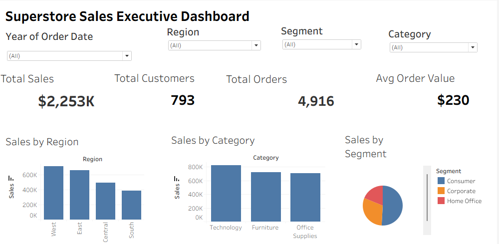
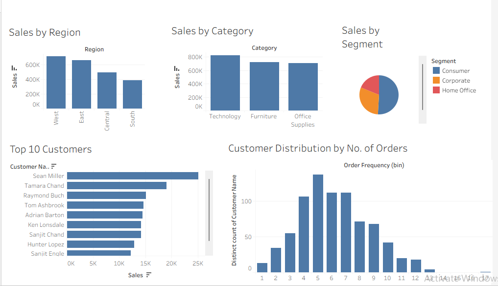

# superstore-sales-analysis
End-to-end data analysis project using Python, SQL, and Tableau
#  Superstore Sales Analysis Dashboard

##  Project Overview
This project presents an end-to-end data analysis of a retail Superstore dataset. The goal is to uncover insights into sales performance, customer behavior, and regional trends using data analytics tools.

---

##  Tools & Technologies
- Python (Pandas) – Data Cleaning & Preparation  
- SQL Server – Data Analysis  
- Tableau – Data Visualization  

---

##  Key KPIs
-  Total Sales: $2.25M  
-  Total Orders: 4,916  
-  Total Customers: 793  
-  Average Order Value: $230  

---

##  Dashboard Preview

---

##  Key Insights
- West region generates the highest sales, while South region underperforms  
- Technology category is the top revenue contributor  
- Consumer segment accounts for the majority of sales  
- Sales are concentrated among a small group of high-value customers  
- Most customers place 4–8 orders, indicating moderate repeat behavior  

---

##  Business Recommendations
- Expand operations in underperforming regions  
- Focus marketing efforts on high-performing categories  
- Improve customer retention strategies  
- Increase engagement to boost repeat purchases  

---

##  Conclusion
This project demonstrates a complete data analysis workflow from data cleaning to visualization and business insights generation.

---

##  Author
**Shravani Kulaye**
